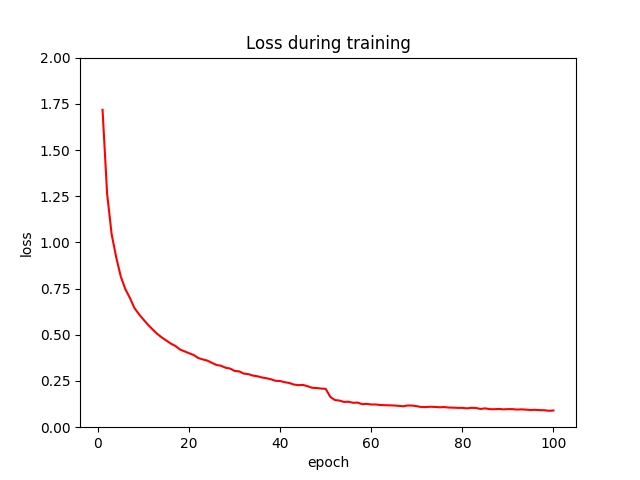

# CNN-for-CIFAR-10-Image-Classification
(1) Data Augmentation: RandomCrop, RandomHorizontalFlip, RandomAffine (shear and scale), and ColorJitter (brightness, contrast, and saturation)  
(2) Three convolution layer blocks: Each block contains two convolutional layers (same size padding, activation function: ReLU), two batch normalizations, one max pooling (kernel size = 2, stride = 2), and one dropout (p = 0.1). The channels increased from 3 to 64, 64 to 128, and 128 to 256 in each block. The size of the input image is 3*32*32, after the whole convolution process, the size of the output will become 256*4*4.  
(3) One fully-connected layer block: The FC layer contains two hidden layers (activation function = ReLU) with 1024 and 512 neurons. The criterion and optimization methods are Cross-Entropy Loss and Adam.  
(4) Hyperparameters:  
&emsp; * Batch Size of the training/test dataset: 200  
&emsp; * Number of Epochs: 100  
&emsp; * Learning Rate:  
&emsp;&emsp; * 1 - 50 epochs: 0.001  
&emsp;&emsp; * 51 - 100 epochs: 0.0001  
  
The Training Process:   
  
  
The Testing Result:  
Accuracy of the network on the 10000 test images: 90.04 %
